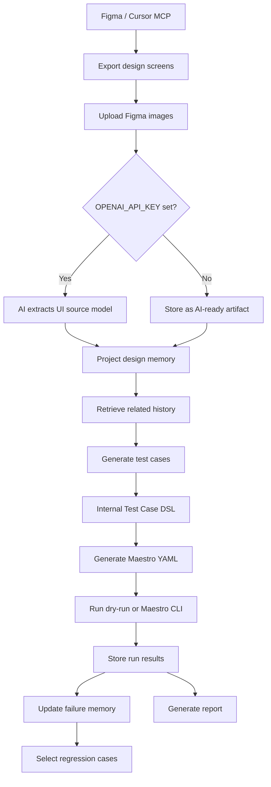
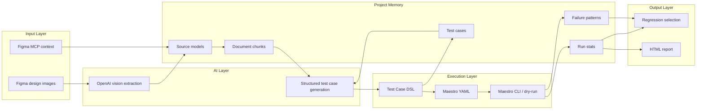
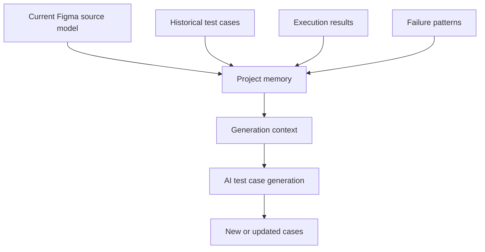
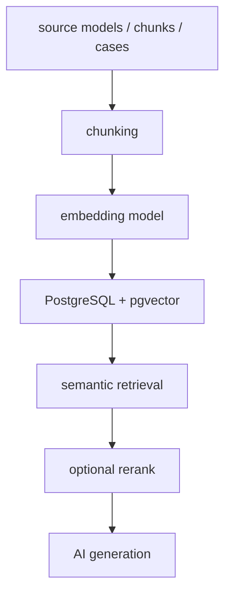
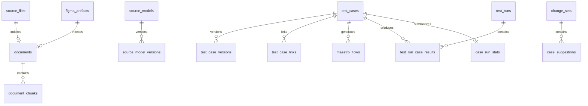

# AI App Test Platform Design

## Product Focus

This MVP is a Figma-driven AI testing platform for mobile apps.

The active workflow is:

- Use Cursor or another MCP-capable tool to work with Figma.
- Export one or more Figma screens as PNG/JPG/WebP.
- Upload those design images to the platform.
- Optionally paste Figma MCP design context.
- Let AI extract UI structure and testable points.
- Generate structured test cases.
- Convert test cases into Maestro YAML.
- Run cases with Maestro dry-run or Maestro CLI.
- Store execution results, failure memory, and regression signals.

The current MVP deliberately keeps the scope narrow: Figma design input, AI-generated test cases, Maestro execution, project memory, and reports.

## Main Workflow



## Design Architecture



## Input Model

The platform currently supports two Figma-oriented inputs.

### Figma Design Images

Users upload one or more exported design screens.

Supported file types:

```text
png
jpg
jpeg
webp
```

When `OPENAI_API_KEY` is configured, each image is sent to OpenAI vision and converted into a structured source model.

When `OPENAI_API_KEY` is not configured, the image is stored as an AI-ready artifact and can still participate in the project memory as a pending source.

### Figma MCP Context

Users can paste selected-frame design context produced by a Figma MCP workflow.

That context is normalized into:

- screen name
- UI elements
- visible text
- control roles
- testable points
- source references

## Source Model

Source models are the structured design memory extracted from Figma inputs.

Example:

```json
{
  "source_type": "figma_image",
  "feature": "login",
  "screen": "Login Flow 1",
  "visible_texts": ["Login", "Phone number", "Continue"],
  "controls": [
    {
      "role": "input",
      "label": "Phone number",
      "description": "Phone number entry field"
    },
    {
      "role": "button",
      "label": "Continue",
      "description": "Primary action button"
    }
  ],
  "states": ["default"],
  "testable_points": [
    "Phone number input should be visible",
    "Continue button should be visible",
    "Continue button should be interactive"
  ],
  "risks": [],
  "open_questions": [],
  "confidence": 0.86
}
```

Source models are stored and versioned so future test generation can compare new designs with historical design memory.

## AI Usage

AI is used in two places.

### Source Model Extraction

If OpenAI is configured, uploaded Figma design images are processed with a vision-capable model through the OpenAI Responses API.

The response is constrained with a JSON schema so the platform receives predictable source model data.

### Test Case Generation

The generator retrieves relevant design memory and historical testing context, then asks OpenAI to return structured test cases.

If OpenAI is not configured, the platform falls back to a deterministic rule-based generator.

Current model configuration:

```bash
export OPENAI_API_KEY=...
export AI_MODEL=gpt-4.1-mini
```

The platform does not require the OpenAI SDK. It calls the API using Python standard-library HTTP.

## Test Case DSL

The platform stores its own test case model first, then generates Maestro YAML from it.

Example:

```json
{
  "title": "Login screen default state is visible",
  "feature": "login",
  "priority": "P0",
  "platforms": ["android", "ios"],
  "tags": ["smoke", "regression", "login"],
  "preconditions": ["The app is installed"],
  "steps": [
    {
      "action": "launch_app",
      "target": {},
      "value": "",
      "note": ""
    },
    {
      "action": "assert",
      "target": {
        "text": "Continue"
      },
      "value": "",
      "note": "Verify primary action is visible"
    }
  ],
  "assertions": [
    {
      "type": "visible",
      "target": {
        "text": "Continue"
      },
      "expected": "Continue button is visible"
    }
  ]
}
```

This keeps Maestro as the first executor without making Maestro YAML the platform's source of truth.

## Maestro Execution

Generated test cases can be converted into Maestro YAML.

Example:

```yaml
appId: ${APP_ID}
tags:
  - smoke
  - regression
  - login
---
- launchApp
- assertVisible: "Continue"
```

Execution modes:

- dry-run by default
- Maestro CLI when `MAESTRO_ENABLED=true`

Recommended command:

```bash
npm run dev:maestro
```

## Project Memory

The product owns long-term memory. The AI model is used for reasoning, but memory is persisted in the product database.

Current memory categories:

- design source files
- Figma MCP artifacts
- source models
- source model versions
- test cases
- test case versions
- case-source links
- run results
- run statistics
- failure patterns
- change sets
- AI suggestions

Memory context can be retrieved for a feature/screen and passed into future generation.



## Regression Selection

Regression selection is explainable and score-based.

Signals:

- feature match
- tag match
- semantic similarity from retrieved context
- priority
- smoke coverage
- recent failure
- failure history
- flaky score

Scoring shape:

```text
score =
  direct_feature_match * 40
+ semantic_similarity * 25
+ tag_match * 15
+ priority_weight
+ smoke_coverage * 5
+ recent_failure * 15
+ failure_history * 10
+ flaky_attention * 4
```

Regression output is used to decide which cases should run before delivery.

## RAG Implementation

The current MVP uses lightweight retrieval.

Current retrieval:

```text
document chunks
+ token similarity
+ feature metadata boost
+ screen metadata boost
```

This is enough for the MVP because the data volume is small and the goal is to validate the product loop.

## Embedding Roadmap

The current implementation does not use an embedding database.

Recommended upgrade:



The public retrieval API can remain similar while the implementation changes from token matching to vector search.

## Data Model

Core persisted entities:



## Runtime Architecture

```text
Frontend: Static HTML/CSS/JS
Backend: Python standard-library HTTP server
Database: SQLite
AI: OpenAI Responses API when configured
Retrieval: lightweight token retrieval
Executor: Maestro YAML generator + dry-run runner
Optional executor: local Maestro CLI
Reports: HTML
Dev entrypoint: npm scripts
```

## API Surface

Current APIs:

- `GET /api/health`
- `GET /api/ai/status`
- `POST /api/source-files`
- `GET /api/source-files`
- `POST /api/figma/mcp-context`
- `GET /api/figma/artifacts`
- `POST /api/generate-cases`
- `GET /api/test-cases`
- `POST /api/test-cases/{id}/approve`
- `POST /api/test-cases/{id}/maestro`
- `GET /api/memory`
- `GET /api/memory/context`
- `POST /api/source-models`
- `GET /api/source-models`
- `POST /api/change-sets`
- `POST /api/case-suggestions`
- `POST /api/regression/select`
- `POST /api/runs`
- `GET /api/runs/{id}`
- `GET /api/reports/{run_id}.html`

## Current Constraints

- The active input path is Figma-only.
- OpenAI is optional; fallback generation remains available.
- Maestro CLI is optional; dry-run remains available.
- Retrieval is token-based, not embedding-based.
- Runtime visual comparison is not yet implemented.
- Suggestion review exists at the data/API level, but the UI review workflow is still minimal.

