# AI App Test Platform Design

## Product Vision

This product is an AI-assisted mobile app testing platform.

Its first version focuses on:

- Reading product documents, Figma summaries, historical test cases, and defect records
- Generating structured test cases
- Persisting test cases and their sources
- Converting test cases into Maestro YAML flows
- Selecting regression cases before delivery
- Running dry-run or real Maestro execution
- Producing release-oriented test reports

The core idea is not to let AI randomly click through an app. AI should understand, generate, retrieve, and analyze. Actual execution should remain structured, auditable, and reproducible.

## Product Positioning

The product should be positioned as:

> An AI test case generation and intelligent regression execution platform for mobile app teams.

The valuable parts are:

- AI understands product intent from requirements and designs
- Test cases are stored, reviewed, versioned, and reused
- Execution is stable and reproducible
- Regression scope is selected with explainable signals
- Reports help the team decide whether a build can ship

## High-Level Workflow

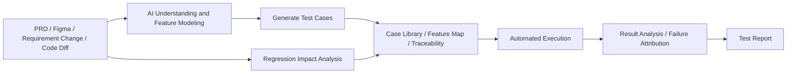

## MVP Scope

The first version should do these things well:

1. Upload PRD or Figma-derived context
2. Retrieve historical documents, designs, cases, and bugs
3. Generate structured test cases
4. Store cases in a case library
5. Review and approve generated cases
6. Generate Maestro YAML flows
7. Select regression cases from feature and change information
8. Execute in dry-run mode or through Maestro CLI
9. Generate HTML test reports
10. Maintain project-level testing memory

Current scope adjustment:

> For the active MVP, PRD ingestion is paused. The primary source of truth is Figma design context, either through Figma MCP context or uploaded Figma design images.

Current Figma-only flow:

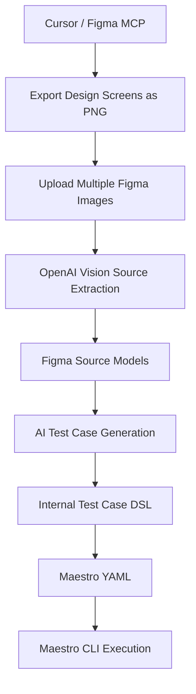

PRD-specific parsing and PRD/Figma cross-source alignment should remain a future capability, not part of the active MVP path.

Out of scope for the MVP:

- Fully autonomous exploratory testing
- Complex production-grade semantic RAG
- Full device cloud orchestration
- Long-term personal conversation memory
- Enterprise RBAC and audit trails

## Why Maestro for Version 1

Maestro is a good fit for the MVP because its YAML flow format is:

- Easy for AI to generate
- Easy for QA to review
- Easy to store and version
- More concise than generating Appium code directly
- Good enough for smoke tests and targeted regression flows

Example Maestro flow:

```yaml
appId: ${APP_ID}
tags:
  - smoke
  - regression
  - login
---
- launchApp
- tapOn: "Login"
- tapOn:
    id: "phone_input"
- inputText: "${PHONE}"
- tapOn:
    id: "login_button"
- assertVisible: "Home"
```

Important product decision:

> Maestro should be the first executor, not the platform's core data model.

The platform stores its own Test Case DSL and generates Maestro YAML from it. This avoids locking the product into one automation framework.

## Execution Architecture

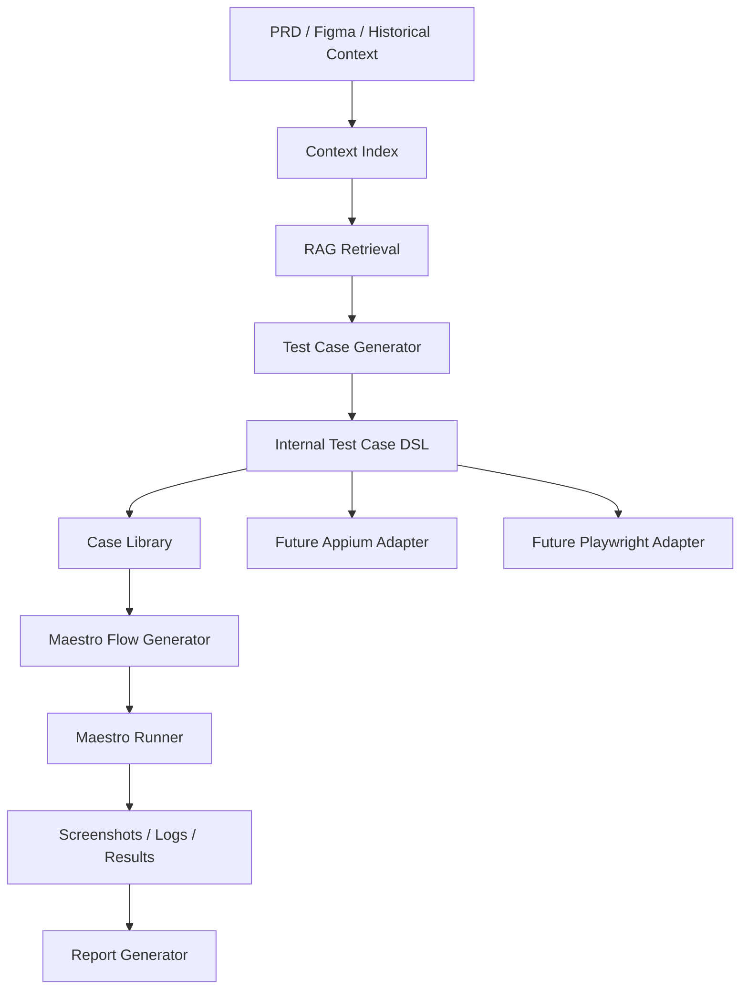

## Internal Test Case DSL

The platform should store structured test cases rather than raw Maestro YAML.

Example:

```json
{
  "case_id": "login_success_001",
  "title": "Phone verification login succeeds",
  "feature": "login",
  "priority": "P0",
  "tags": ["smoke", "regression", "login"],
  "platforms": ["android", "ios"],
  "preconditions": [
    "The app is installed",
    "Test account and test data are ready"
  ],
  "steps": [
    {
      "action": "tap",
      "target": {
        "text": "Login"
      }
    },
    {
      "action": "input",
      "target": {
        "id": "phone_input"
      },
      "value": "{{test_user.phone}}"
    }
  ],
  "assertions": [
    {
      "type": "visible",
      "target": {
        "text": "Home"
      }
    }
  ],
  "source_refs": [
    {
      "type": "figma",
      "id": "123:456"
    },
    {
      "type": "prd",
      "id": "req_789"
    }
  ]
}
```

## Test Case Lifecycle

AI-generated cases should not directly become trusted regression assets. They need a lifecycle:

```text
draft -> ai_generated -> reviewed -> approved -> executable -> deprecated
```

The current MVP supports generated, approved, and executable states. Future versions should add richer review and versioning.

## RAG Design

The MVP uses a lightweight built-in RAG layer.

Current implementation:

- Stores uploaded documents in SQLite
- Splits documents into chunks
- Tokenizes English, numbers, and CJK characters
- Scores chunks using token cosine similarity
- Adds metadata boosts for feature and screen matches

Current scoring shape:

```text
score =
  token_cosine_similarity
+ feature_metadata_boost
+ screen_metadata_boost
```

This is sufficient for an MVP because it can run without external dependencies and validates the full product loop:

```text
source context -> retrieval -> generated cases -> regression selection -> execution -> report
```

It is not production-grade semantic RAG. A production version should upgrade to:

```text
LlamaIndex + PostgreSQL + pgvector + metadata filters + reranker
```

## Lightweight RAG vs LlamaIndex

| Capability | Built-In Lightweight RAG | LlamaIndex-Based RAG |
|---|---:|---:|
| Runs without setup | Strong | Requires dependencies |
| Deployment complexity | Low | Medium |
| SQLite storage | Built in | Possible |
| Keyword retrieval | Supported | Supported |
| Semantic vector retrieval | Not supported | Supported |
| Reranking | Not supported | Supported |
| Data connectors | Manual work | Strong ecosystem |
| Structured extraction | Rule-based | Better with LLM integration |
| Production scalability | Limited | Stronger |

The lightweight layer is a product skeleton. LlamaIndex is the recommended production path.

## Real Source Ingestion

The current MVP treats `PRD` and `Figma` as source labels plus manually pasted text. This is enough to validate the product loop, but it is not a complete product-grade ingestion flow.

A more complete version needs real source ingestion:

1. PRD document ingestion
   - Upload `.md`, `.txt`, `.pdf`, or `.docx`
   - Or connect to Notion, Confluence, Lark, Google Docs, or similar document systems
   - Parse headings, body text, tables, acceptance criteria, and requirement IDs
   - Store raw source, extracted text, chunks, and source references
   - Link extracted content to features, screens, and test cases

   Current MVP implementation:

   - `.txt`, `.md`, `.json`, `.csv`, `.tsv`, `.yaml`, and `.yml` are extracted directly
   - `.docx` is parsed from Word document XML
   - `.pdf` files are stored as AI-ready artifacts and indexed with extraction notes
   - image files are stored as AI-ready artifacts and indexed with extraction notes
   - extracted text is persisted as a normal document and enters the RAG index

2. Figma URL ingestion
   - Accept a Figma file or node URL
   - Parse `file_key` and `node-id`
   - Fetch the Figma node tree
   - Extract screens, components, text, buttons, inputs, layout information, and prototype links where available
   - Convert the design into a structured screen and UI model
   - Index that model for RAG and test generation

The target flow should look like this:

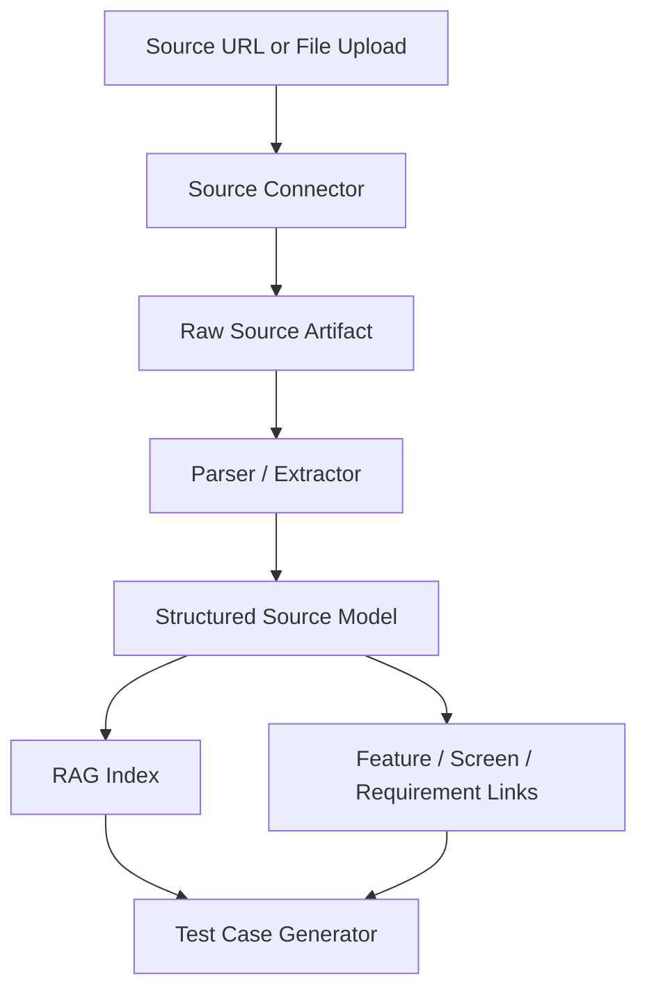

## Figma Integration: REST API vs MCP

Figma ingestion does not strictly require MCP. There are two useful integration paths.

### Option A: Figma REST API

This is the most stable and controllable backend path for the product.

The platform can:

```text
User submits Figma URL
-> Backend parses file_key and node_id
-> Backend calls Figma REST API with FIGMA_ACCESS_TOKEN or OAuth
-> Backend fetches file or node JSON
-> Figma parser extracts UI structure
-> Structured model is stored and indexed
-> Test cases are generated from real design data
```

Figma's REST API provides file and node endpoints:

- `GET /v1/files/:key`
- `GET /v1/files/:key/nodes`
- `GET /v1/images/:key`

The file key and node ID can be parsed from normal Figma URLs.

REST API advantages:

- Stable product backend integration
- Easier to deploy in SaaS environments
- Easier to cache, retry, audit, and rate-limit
- Does not require the user to run a local MCP client
- Works well with explicit OAuth/token-based permissions

REST API limitations:

- The product must implement its own parser
- The raw node tree can be verbose and low-level
- Higher-level design intent often needs additional heuristics or AI extraction
- Design system semantics may require custom mapping

### Option B: Figma MCP Server

Figma's Dev Mode MCP Server is more AI-native. It is designed to provide design context directly to AI agents and developer tools.

It is useful for:

- Letting an AI agent inspect selected frames
- Pulling richer design context into coding or testing workflows
- Working with Dev Mode and Code Connect
- Reusing component and variable context from a design system

MCP advantages:

- Better fit for AI-agent workflows
- Can provide richer context than raw JSON in some workflows
- Useful for design-to-code or design-to-test reasoning
- Helps agents work with selected frames and design-system context

MCP limitations:

- More complex to integrate as a backend product dependency
- Requires MCP-capable clients or a carefully designed connector flow
- Permissions, workspace connection, and user authorization need clear product design
- The platform still needs to persist the result into its own structured model

Recommended approach:

> Use Figma MCP as the first AI understanding path. Keep Figma REST API as the background sync, cache, version-diff, and audit path.

This is an adjustment from a pure REST-first plan. The reason is that REST API gives the product raw design data, but the product still has to build a parser that understands what the screen means. MCP is closer to the desired testing workflow because it gives AI agents structured design context from selected frames.

The product should treat the two channels differently:

1. AI Context Channel: Figma MCP
   - Used for understanding selected frames
   - Used for extracting screen intent, visible elements, component semantics, expected states, and testable points
   - Used to generate test cases quickly from real design context

2. Data Sync Channel: Figma REST API
   - Used for backend cache
   - Used for version diff
   - Used for audit and reprocessing
   - Used for batch refresh and traceability

Key boundary:

> Figma MCP helps AI understand what the design expects. It does not validate the running app by itself.

Runtime validation still needs Maestro, Appium, screenshots, OCR, accessibility trees, logs, and deterministic assertions.

PRD and Figma should not be mutually exclusive. They should be complementary sources. The case generator should retrieve both requirement context and design context, then generate cases that use both when available.

Cross-source behavior:

```text
PRD context explains what the feature should do.
Figma MCP context explains what the screen should show.
The generator combines both and creates alignment cases.
```

Example alignment case:

```text
Title: login PRD and Figma alignment validation
Goal: runtime UI should satisfy the requirement and match the design context
Sources: PRD chunks + Figma MCP screen model
```

Combined architecture:

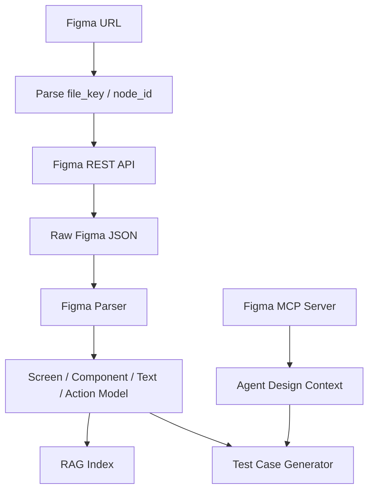

Updated MCP-first architecture:

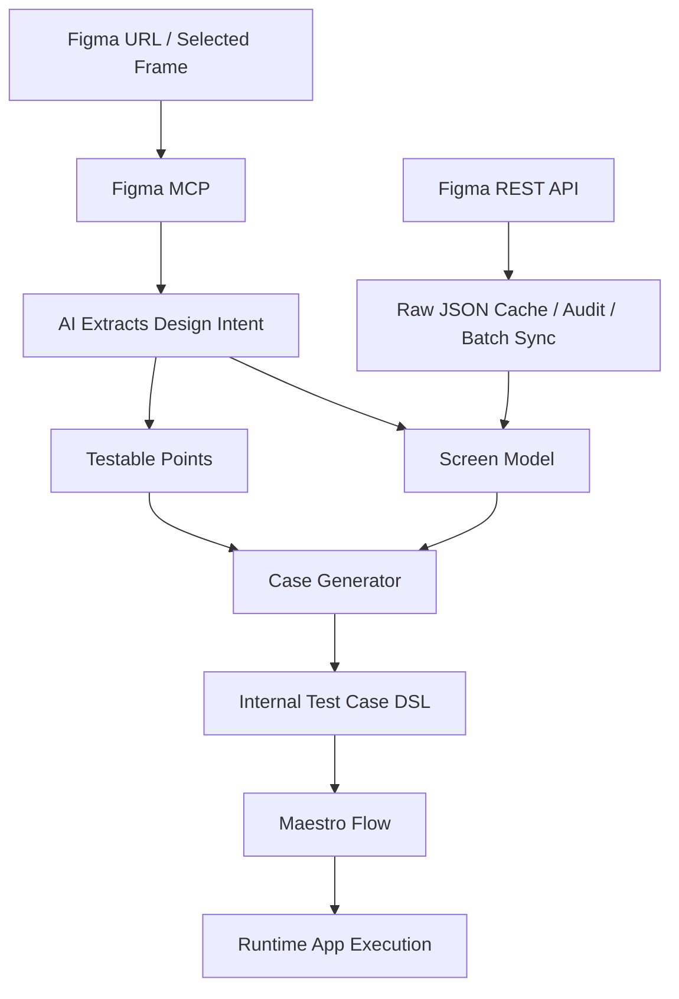

Full UI validation loop:

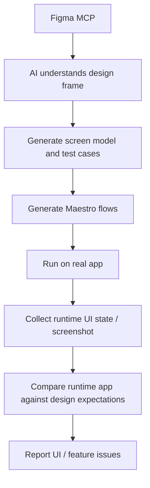

Practical validation split:

- Figma MCP provides expected design context: screen name, visible text, components, layout intent, component semantics, and design tokens
- Maestro executes the app: tap, input, navigate, assert visible, and capture runtime evidence
- AI validates broad UI/design expectations: required text is present, key components are visible, layout is not obviously broken, and critical design states match expectations
- Deterministic assertions validate stable product behavior: page exists, button visible, toast visible, route reached, and API state valid

Implementation roadmap:

```text
MVP:
  manual text / doc upload

MVP+:
  Figma MCP context ingestion for selected-frame understanding and test generation

V1:
  Figma REST API for background sync, version diff, and traceability

V2:
  MCP + REST + design system Code Connect + runtime visual comparison
```

## Figma Parsing Model

The parser should convert raw Figma nodes into a compact model that is useful for testing.

Example target model:

```json
{
  "source": "figma",
  "file_key": "abc123",
  "node_id": "12:34",
  "screen": "Login Screen",
  "elements": [
    {
      "type": "TEXT",
      "name": "Title",
      "text": "Login"
    },
    {
      "type": "TEXT",
      "name": "Phone placeholder",
      "text": "Phone number"
    },
    {
      "type": "INSTANCE",
      "name": "Primary Button",
      "text": "Continue",
      "component": "Button/Primary"
    }
  ],
  "testable_points": [
    "Login screen should show Phone number input",
    "Continue button should be visible",
    "Invalid code message should be displayed for wrong verification code"
  ]
}
```

Suggested extraction rules:

- Treat top-level frames as screens
- Treat `TEXT` nodes as visible copy and assertion candidates
- Treat component instances as semantic controls when component metadata is available
- Detect common control names such as button, input, tab, checkbox, switch, dialog, toast, and modal
- Extract prototype links when available and use them as navigation candidates
- Preserve Figma node IDs as source references
- Generate testable points from visible UI, interactive elements, and requirement-linked frames

This model should be stored separately from the raw Figma JSON. The raw JSON is useful for audit and reprocessing, while the compact model is useful for RAG, case generation, and regression impact analysis.

## Regression Selection

Regression selection should be explainable. The platform should not ask AI to choose cases by intuition alone.

Regression inputs:

- Changed features
- Changed screens
- Requirement change summary
- Historical execution results
- Historical failure patterns
- Priority and smoke tags

MVP scoring:

```text
score =
  direct_feature_match * 40
+ semantic_similarity * 25
+ tag_match * 15
+ priority_weight
+ smoke_coverage * 5
+ recent_failure * 15
+ failure_history * 10
+ flaky_attention * 4
```

Regression selection flow:

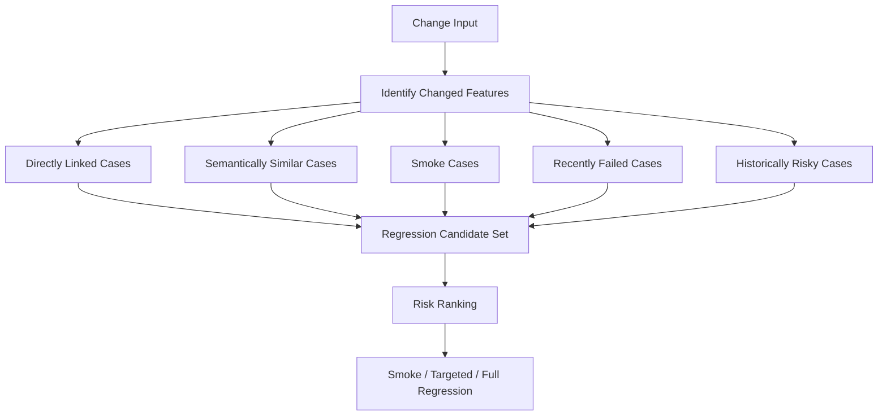

Suggested regression tiers:

- Smoke: core P0 flows, run on every commit or build
- Targeted Regression: cases related to the current change
- Full Regression: nightly or release-candidate runs
- Risk-Based Regression: selected from historical failures and high-risk areas

## Project Memory

The MVP should include project-level memory, not black-box agent memory.

This means the system should remember facts that are useful, traceable, and auditable:

- Historical PRDs
- Figma summaries
- Historical test cases
- Case-source links
- Feature and screen associations
- Historical execution results
- Failure patterns
- Case pass rates
- Flaky scores

It should not initially include:

- Personal user preference memory
- Long-term conversation memory
- Hidden agent memory
- Unexplainable "AI remembers" behavior

Project memory layers:

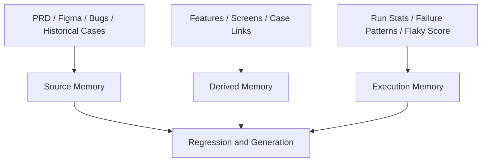

Current memory tables:

- `features`
- `screens`
- `test_case_links`
- `case_run_stats`
- `failure_patterns`

Example case memory:

```json
{
  "case_id": 12,
  "last_status": "failed",
  "failure_count_30d": 3,
  "pass_rate": 0.82,
  "avg_duration_ms": 18000,
  "flaky_score": 0.27,
  "linked_bug_count": 2
}
```

## Iterative Product Memory Implementation

The product should support iterative feature development. A feature may change many times, and test cases must stay aligned with the latest PRD, Figma design, source model, and historical execution results.

The key principle:

> OpenAI API is the reasoning engine. The product database is the long-term memory.

The platform should not rely on hidden model memory. Every important historical fact should be stored, versioned, retrievable, and explainable.

### Memory Responsibilities

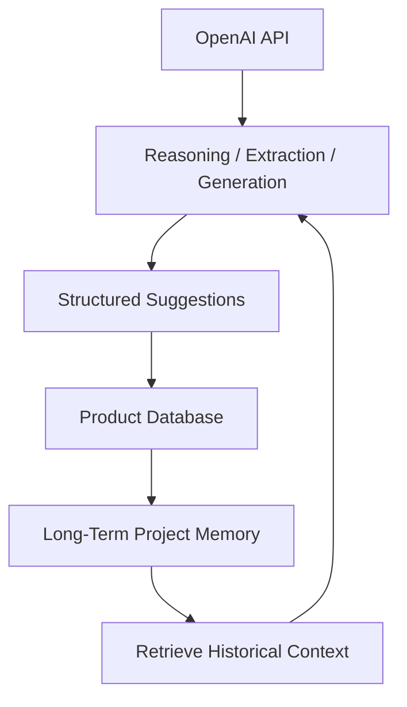

OpenAI should do:

- Extract source facts from PRD, Figma, images, and documents
- Compare current source model with historical source models
- Generate new cases
- Suggest case updates
- Suggest deprecated cases
- Explain regression candidates

The product database should store:

- Source files and documents
- Source models and source model versions
- Test cases and test case versions
- Case-source links
- Change sets
- AI suggestions
- Execution history and failure patterns

### Iteration Flow

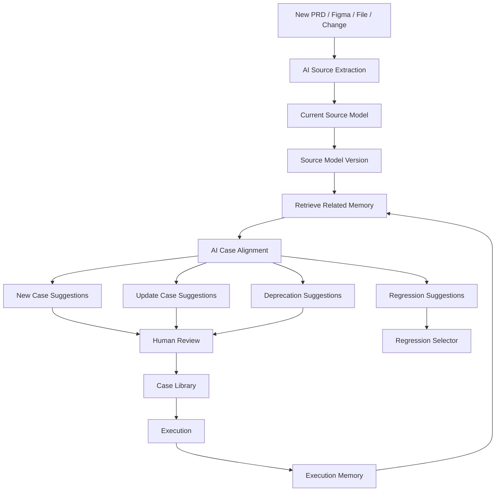

### Source Model

AI Source Extraction should convert each source into a structured source model.

Example:

```json
{
  "source_type": "prd",
  "feature": "login",
  "screen": "Login Screen",
  "version_label": "2026-05-14 login redesign",
  "features": [
    {
      "name": "login",
      "description": "Phone verification login",
      "acceptance_criteria": [
        "Users can log in with a valid phone verification code"
      ],
      "business_rules": [
        "Invalid verification code should show an error message"
      ],
      "edge_cases": [
        "Empty phone number",
        "Expired verification code"
      ],
      "testable_points": [
        "Phone number input is visible",
        "Continue button is visible",
        "Invalid code error is displayed"
      ]
    }
  ],
  "screens": [
    {
      "name": "Login Screen",
      "visible_texts": ["Login", "Phone number", "Continue"],
      "controls": [
        {"role": "input", "label": "Phone number"},
        {"role": "button", "label": "Continue"}
      ],
      "states": ["default", "invalid code"]
    }
  ],
  "risks": [],
  "open_questions": [],
  "confidence": 0.86
}
```

### Historical Context Package

Before asking OpenAI to generate or align cases, the backend should retrieve and package memory:

```json
{
  "current_source_model": {},
  "related_source_models": [],
  "related_test_cases": [],
  "recent_failures": [],
  "failure_patterns": [],
  "case_run_stats": [],
  "known_risks": []
}
```

This package becomes part of the OpenAI prompt. The model does not need to remember history by itself; the platform supplies the relevant memory on every request.

### AI Case Alignment Output

For iterative products, AI should return more than `cases`.

Target output:

```json
{
  "new_cases": [],
  "updated_cases": [
    {
      "previous_case_id": 123,
      "change_reason": "Figma changed the primary button label from Continue to Verify",
      "case": {}
    }
  ],
  "deprecated_case_candidates": [
    {
      "case_id": 88,
      "reason": "The password login entry no longer appears in PRD or Figma"
    }
  ],
  "regression_candidates": [
    {
      "case_id": 12,
      "reason": "Same login feature and recent failure history"
    }
  ]
}
```

Review workflow:

```text
ai_suggested -> reviewed -> accepted -> applied
ai_suggested -> reviewed -> rejected
```

### Suggested Tables

The MVP should evolve toward these additional tables:

- `source_models`: latest extracted model for a feature/screen/source
- `source_model_versions`: version history of extracted models
- `test_case_versions`: version history for every test case
- `change_sets`: one product iteration, release, PR, or requirement/design change
- `case_suggestions`: AI suggestions for new/update/deprecate/regression actions

### Alignment Algorithm

```text
1. Ingest new PRD/Figma/file.
2. Run AI Source Extraction to produce source_model.
3. Store source_model and source_model_version.
4. Retrieve related historical source models by feature/screen/semantic similarity.
5. Retrieve related active test cases.
6. Retrieve recent failures and failure patterns.
7. Ask OpenAI for case alignment suggestions.
8. Store suggestions as reviewable records.
9. Human accepts/rejects suggestions.
10. Accepted suggestions update the case library and create test_case_versions.
11. Regression selector uses the same memory for delivery validation.
```

### Why This Works With API-Based AI

API-based AI can support memory when the application owns the memory.

The backend sends:

```text
current source model
+ related historical source models
+ related cases
+ execution memory
+ failure patterns
+ task instructions
```

The model returns structured suggestions. The database stores the result. This makes the system explainable and repeatable.

### API-Based Memory Strategy

Using an API-based model does not prevent memory. The important choice is where memory lives.

Do not rely on hidden model memory for product behavior.

Reasons:

- It is not sufficiently auditable
- It is hard to version
- It is hard to explain why a case was generated
- It does not naturally preserve source references
- It is not suitable as the long-term source of truth for testing assets

Instead:

> OpenAI API handles reasoning. The product owns memory.

Product-owned memory should include:

```text
Source Memory:
  historical PRDs
  Figma design context
  source models
  requirement versions
  feature versions
  screen versions

Case Memory:
  historical test cases
  case versions
  case status
  source refs
  linked feature / screen / requirement
  replaced or deprecated cases

Execution Memory:
  historical execution results
  latest failures
  failure frequency
  flaky score
  linked defects
  last known passing version

Change Memory:
  feature iterations
  PRD diffs
  Figma diffs
  affected cases
  generated suggestions
```

Every OpenAI request should receive a packaged memory context:

```text
Current source model:
...

Related historical source models:
...

Related test cases:
...

Recent failures:
...

Known risks:
...

Task:
Generate new, updated, deprecated, and regression case suggestions.
```

This gives the API call memory without making the model itself the database.

### Suggested AI Alignment Prompt Inputs

When a feature changes, the backend should pass these fields to OpenAI:

```json
{
  "current_source_model": {},
  "related_historical_source_models": [],
  "related_active_cases": [],
  "recent_failures": [],
  "failure_patterns": [],
  "case_run_stats": [],
  "change_summary": "Login UI and invalid code behavior changed",
  "task": "Suggest new, updated, deprecated, and regression cases"
}
```

Expected output:

```json
{
  "new_cases": [],
  "updated_cases": [
    {
      "previous_case_id": 123,
      "change_reason": "Figma changed button text from Continue to Verify",
      "case": {}
    }
  ],
  "deprecated_case_candidates": [
    {
      "case_id": 88,
      "reason": "Password login entry no longer appears in PRD or Figma"
    }
  ],
  "regression_candidates": [
    {
      "case_id": 12,
      "reason": "Same login feature and recent failure history"
    }
  ]
}
```

### UI and Product Flow for Review

AI suggestions should not silently mutate the case library. The product should make suggestions reviewable.

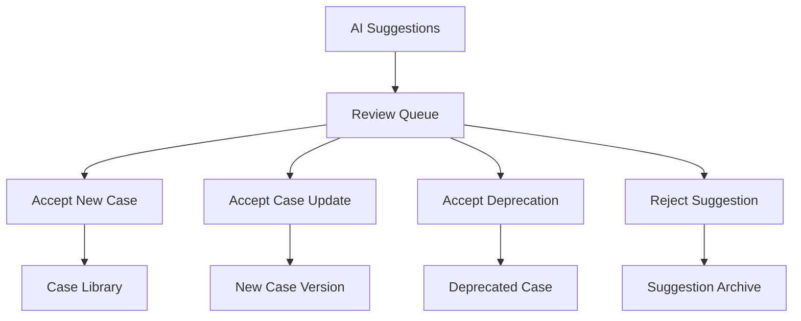

Suggested statuses:

```text
ai_suggested
reviewed
accepted
applied
rejected
```

### Practical Implementation Steps

The MVP implementation path is:

1. Add source model persistence.
2. Add source model versioning.
3. Add test case versioning.
4. Add change sets.
5. Add case suggestions.
6. Add memory context packaging API.
7. Pass memory context into OpenAI case alignment.
8. Add review UI for suggestions.
9. Apply accepted suggestions to the case library.

Current code has implemented steps 1 through 6.

## Test Report Design

Reports should help a team make a release decision, not only display pass/fail counts.

Report contents:

- Release recommendation
- Run summary
- Total, passed, failed, and blocked counts
- Pass rate
- Case-level result table
- Duration
- Runner output
- Future: screenshots, videos, logs, network traces, AI failure attribution

Example release decision:

> Release not recommended. Core login passed, but payment result verification failed in a P1 path. Fix the issue and rerun targeted regression.

## Recommended Production Architecture

```text
Frontend: Next.js + TypeScript
Backend API: Python FastAPI
AI/RAG: LlamaIndex + Pydantic / PydanticAI
Workflow: LangGraph or Temporal
Database: PostgreSQL + pgvector
Queue: Redis + Celery / Dramatiq
Runner: Maestro CLI / Maestro Cloud
Object Storage: S3 / MinIO
Reports: HTML + PDF
CI Integration: GitHub Actions / GitLab CI / Jenkins
```

## Current MVP Architecture

The current repository intentionally keeps the runtime minimal:

```text
Frontend: Static HTML/CSS/JS
Backend: Python standard-library HTTP server
Database: SQLite
RAG: Built-in token retrieval
AI Provider: OpenAI Responses API when OPENAI_API_KEY is set
Executor: Maestro YAML generator + dry-run runner
Optional Executor: Local Maestro CLI
Reports: HTML
Dev Entrypoint: npm scripts
```

## AI Usage

The current implementation now has a real AI integration point.

AI is used for:

- Test case generation from retrieved Figma and historical context
- Figma design image extraction into source models when `OPENAI_API_KEY` is set
- Structured output into the platform Test Case DSL shape

AI is not yet used for:

- Direct PDF parsing
- PRD-first source extraction in the active MVP path
- Direct Figma MCP Server connection
- Runtime screenshot comparison
- Failure attribution

Configuration:

```bash
export OPENAI_API_KEY=...
export AI_MODEL=gpt-4.1-mini
```

Implementation details:

- API: OpenAI Responses API
- Output mode: Structured Outputs using JSON Schema
- Runtime dependency: no OpenAI SDK required; the MVP uses Python standard-library HTTP
- Fallback: if `OPENAI_API_KEY` is missing or the API call fails, the rule-based generator is used
- Observability: `GET /api/ai/status` reports provider, model, enabled state, last generation mode, and last generation error

Generation flow:

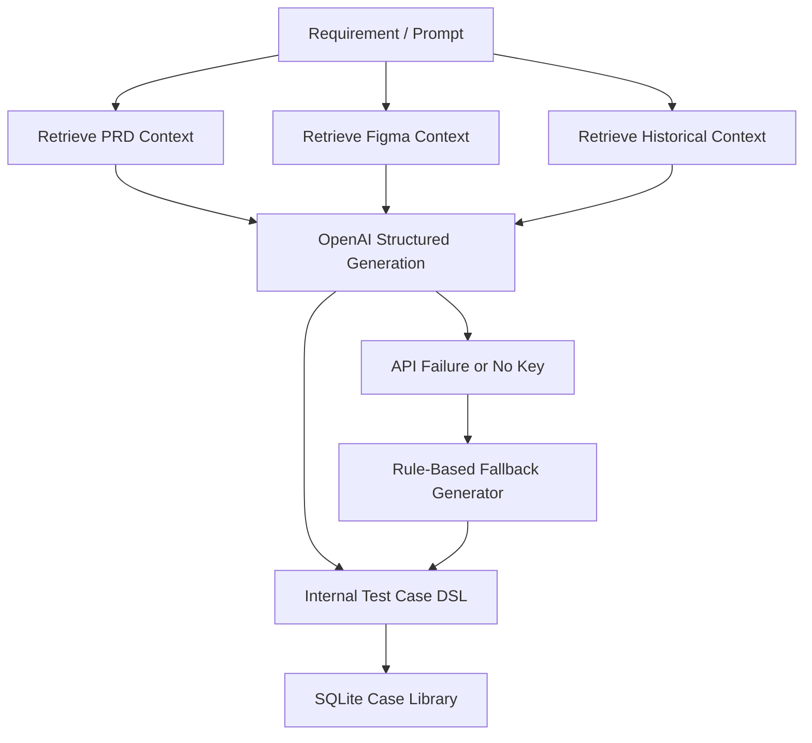

## Current OpenAI Request Shape

The MVP currently calls OpenAI only during test case generation.

The request does not send raw files directly. Instead, the backend first parses or extracts source content, stores it, retrieves relevant context, and sends that context to OpenAI.

Current flow:

```text
PRD / Figma / Uploaded File
-> local extraction or Figma MCP context parsing
-> SQLite documents and chunks
-> lightweight RAG retrieval
-> OpenAI structured test case generation
-> Test Case DSL
```

Current OpenAI input fields:

- `requirement`
- `feature`
- `screen`
- `platforms`
- `max_cases`
- retrieved PRD context
- retrieved Figma/design context
- retrieved historical context

Representative request body:

```json
{
  "model": "gpt-4.1-mini",
  "input": "You are generating executable mobile app test cases...\n\nFeature: login\nScreen: Login Screen\nPlatforms: android, ios\n\nRequirement:\n...\n\nPRD / requirement context:\n...\n\nFigma / design context:\n...\n\nCombined retrieved context:\n...",
  "text": {
    "format": {
      "type": "json_schema",
      "name": "test_case_generation",
      "strict": true,
      "schema": {
        "type": "object",
        "required": ["cases"],
        "properties": {
          "cases": {
            "type": "array"
          }
        }
      }
    }
  }
}
```

Representative structured output:

```json
{
  "cases": [
    {
      "title": "Phone verification login succeeds",
      "feature": "login",
      "priority": "P0",
      "platforms": ["android", "ios"],
      "tags": ["smoke", "regression", "login"],
      "preconditions": ["The app is installed"],
      "steps": [
        {
          "action": "launch_app",
          "target_text": "",
          "target_id": "",
          "value": "",
          "note": ""
        },
        {
          "action": "tap",
          "target_text": "Login",
          "target_id": "",
          "value": "",
          "note": "Open login screen"
        }
      ],
      "assertions": [
        {
          "type": "visible",
          "target_text": "Home",
          "target_id": "",
          "expected": "Home is visible"
        }
      ],
      "source_summary": "Generated from PRD and Figma context."
    }
  ]
}
```

### Direct Source Parsing With OpenAI

The platform can also use OpenAI API for source extraction.

Recommended split:

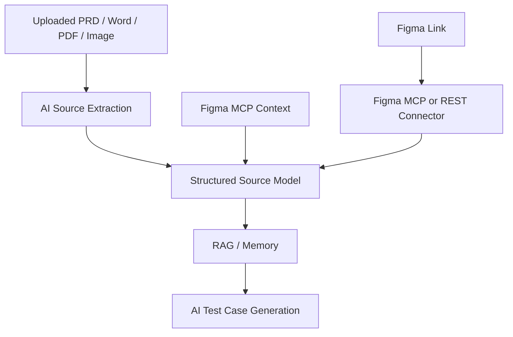

Input-specific recommendations:

- PRD / Markdown / TXT: read text locally, then run OpenAI structured extraction
- Word / DOCX: extract text locally from document XML, then run OpenAI structured extraction
- PDF: extract text locally when possible; for scanned PDFs, convert pages to images and use vision extraction
- Figma image / screenshot: use a vision-capable model to extract screen structure, visible text, controls, states, and testable points
- Figma link: do not send the bare link to OpenAI; use Figma MCP or Figma REST API to fetch authorized design context first

Suggested AI Source Extraction output:

```json
{
  "source_type": "prd",
  "features": [
    {
      "name": "login",
      "description": "Phone verification login",
      "acceptance_criteria": [],
      "business_rules": [],
      "edge_cases": [],
      "testable_points": []
    }
  ],
  "screens": [
    {
      "name": "Login Screen",
      "visible_texts": [],
      "controls": [],
      "states": []
    }
  ],
  "risks": [],
  "open_questions": [],
  "confidence": 0.86
}
```

Recommendation:

> MVP+ should use OpenAI Responses API with Structured Outputs directly for source extraction. Add LlamaIndex later for large-scale indexing, connectors, metadata filters, and reranking.

The AI stack should be layered:

```text
OpenAI API:
  understanding, source extraction, structured generation, alignment reasoning

Product DB:
  long-term memory, versions, source refs, case history, execution memory

LlamaIndex or similar framework:
  future large-scale retrieval, connectors, indexing, reranking
```

### Source Extraction vs Case Generation

The product should keep source extraction and test generation as two separate AI calls:

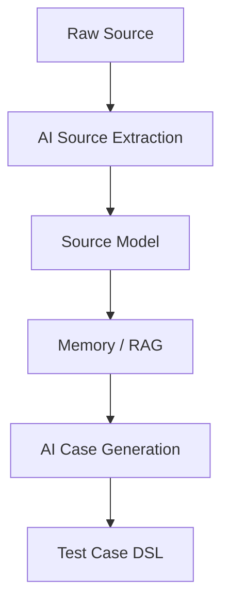

Why two stages:

- Source models can be cached
- Extracted facts can be reviewed
- Test generation can reuse the same source model many times
- Regression selection can use source models without regenerating cases
- Historical source model diff becomes possible

Current commands:

```bash
npm run setup
npm run dev
npm run dev:maestro
npm test
npm run check
```

## Data Model

Current persisted entities:

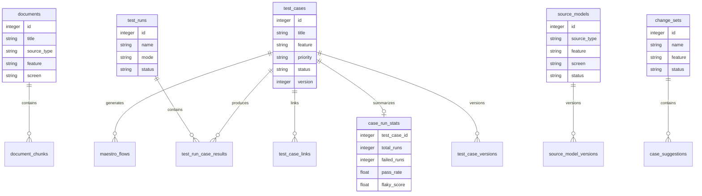

## API Surface

Current MVP APIs:

- `GET /api/health`
- `GET /api/ai/status`
- `POST /api/documents`
- `GET /api/documents`
- `POST /api/source-files`
- `GET /api/source-files`
- `POST /api/figma/mcp-context`
- `GET /api/figma/artifacts`
- `POST /api/generate-cases`
- `GET /api/test-cases`
- `GET /api/memory`
- `GET /api/memory/context`
- `POST /api/source-models`
- `GET /api/source-models`
- `POST /api/change-sets`
- `POST /api/case-suggestions`
- `POST /api/test-cases/{id}/approve`
- `POST /api/test-cases/{id}/maestro`
- `POST /api/regression/select`
- `POST /api/runs`
- `GET /api/runs/{id}`
- `GET /api/reports/{run_id}.html`

## Dependency Strategy

The MVP has no third-party Python dependency. This was deliberate so the product can be deployed and demonstrated in a clean environment.

Dependency decisions:

- Maestro CLI is optional. Without it, dry-run execution still works.
- LlamaIndex is not required for the MVP.
- pgvector is not required for the MVP.
- LangGraph or Temporal is not required for the MVP.

Production upgrade path:

1. Replace the built-in RAG layer with LlamaIndex.
2. Replace SQLite with PostgreSQL and pgvector.
3. Replace synchronous job execution with Celery, Dramatiq, LangGraph, or Temporal.
4. Add real device orchestration.
5. Add artifact storage for screenshots, videos, logs, and reports.

## Risks and Constraints

Known MVP limitations:

- Retrieval is token-based, not embedding-based
- Figma input is currently expected as text summary, not direct Figma API sync
- Maestro execution is dry-run unless Maestro CLI is installed
- No real device lab management yet
- No screenshot or video artifact capture yet
- No authenticated multi-user workspace model yet
- No human review diff UI yet

Key architectural guardrail:

> Store platform-native test cases first. Generate Maestro flows as executor artifacts.

This keeps the system flexible as the product grows.
