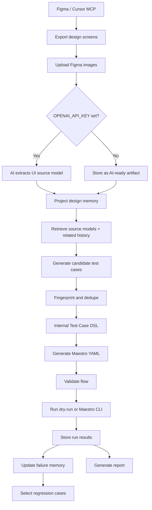
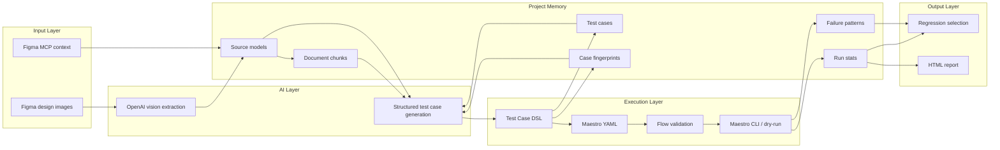
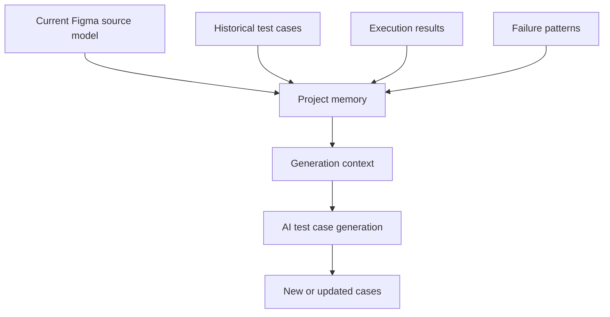
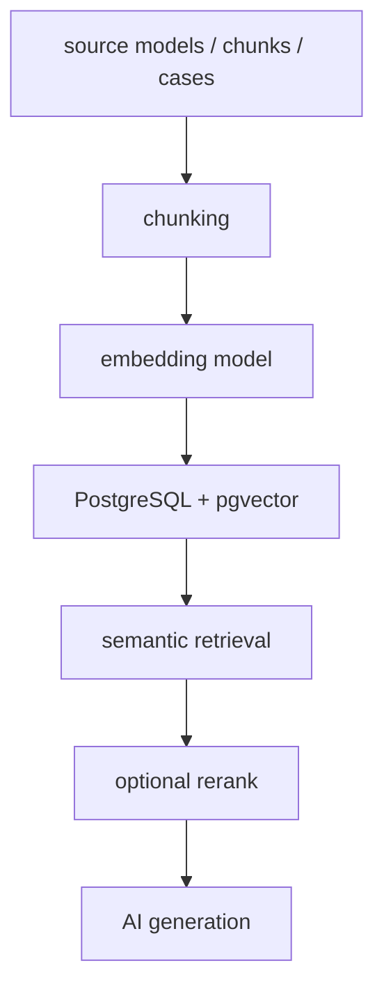
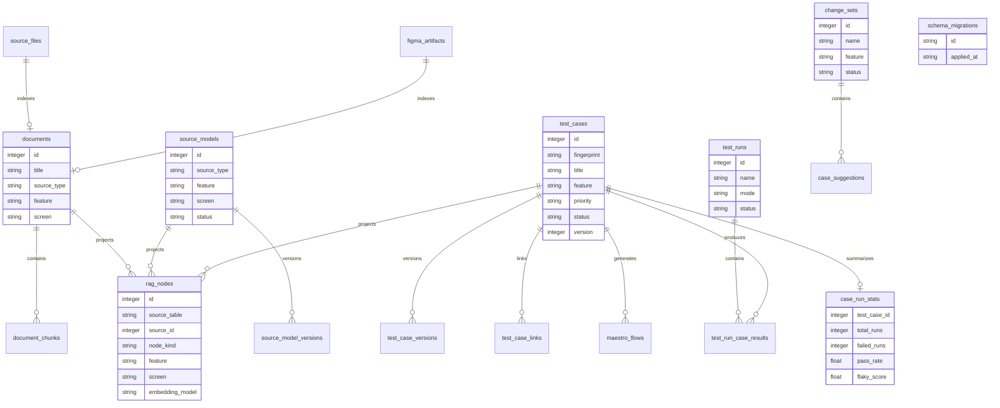
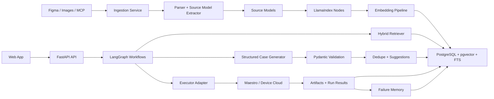

# AI App Test Platform Design

## Product Focus

This MVP is a Figma-driven AI testing platform for mobile apps.

The active workflow is:

- Use Cursor or another MCP-capable tool to work with Figma.
- Export one or more Figma screens as PNG/JPG/WebP.
- Upload those design images to the platform.
- Optionally paste Figma MCP design context.
- Let AI extract UI structure and testable points.
- Generate structured test cases.
- Convert test cases into Maestro YAML.
- Run cases with Maestro dry-run or Maestro CLI.
- Store execution results, failure memory, and regression signals.

The current MVP deliberately keeps the scope narrow: Figma design input, AI-generated test cases, Maestro execution, project memory, and reports.

The upgraded implementation keeps that MVP shape, but tightens the product loop around four reliability goals:

- structured source models are first-class generation context, not only text chunks
- generated cases receive stable fingerprints so repeated generation does not pollute the library
- Maestro dry-run validates generated flows before marking them usable
- SQLite owns lightweight migrations and lookup indexes so the local MVP can evolve safely

## Main Workflow



## Design Architecture



## Input Model

The platform currently supports two Figma-oriented inputs.

### Figma Design Images

Users upload one or more exported design screens.

Supported file types:

```text
png
jpg
jpeg
webp
```

When `OPENAI_API_KEY` is configured, each image is sent to OpenAI vision and converted into a structured source model.

When `OPENAI_API_KEY` is not configured, the image is stored as an AI-ready artifact and can still participate in the project memory as a pending source.

### Figma MCP Context

Users can paste selected-frame design context produced by a Figma MCP workflow.

That context is normalized into:

- screen name
- UI elements
- visible text
- control roles
- testable points
- source references

## Source Model

Source models are the structured design memory extracted from Figma inputs.

Example:

```json
{
  "source_type": "figma_image",
  "feature": "login",
  "screen": "Login Flow 1",
  "visible_texts": ["Login", "Phone number", "Continue"],
  "controls": [
    {
      "role": "input",
      "label": "Phone number",
      "description": "Phone number entry field"
    },
    {
      "role": "button",
      "label": "Continue",
      "description": "Primary action button"
    }
  ],
  "states": ["default"],
  "testable_points": [
    "Phone number input should be visible",
    "Continue button should be visible",
    "Continue button should be interactive"
  ],
  "risks": [],
  "open_questions": [],
  "confidence": 0.86
}
```

Source models are stored and versioned so future test generation can compare new designs with historical design memory.

Source models now participate directly in case generation. The generator retrieves matching active source models by `feature` and `screen`, formats their structured fields, and gives them higher context priority than generic document chunks. This avoids relying only on flattened text and keeps generated cases closer to concrete UI controls, states, visible copy, and known risks.

Generation context priority:

```text
active source_models for feature/screen
+ Figma MCP and Figma image chunks
+ other retrieved history chunks
+ run statistics and failure memory
```

The flattened document chunk is still useful for lightweight retrieval and fallback behavior, but the source model is the preferred product memory object.

## AI Usage

AI is used in two places.

### Source Model Extraction

If OpenAI is configured, uploaded Figma design images are processed with a vision-capable model through the OpenAI Responses API.

The response is constrained with a JSON schema so the platform receives predictable source model data.

### Test Case Generation

The generator retrieves relevant design memory and historical testing context, then asks OpenAI to return structured test cases.

If OpenAI is not configured, the platform falls back to a deterministic rule-based generator.

Current model configuration:

```bash
export OPENAI_API_KEY=...
export AI_MODEL=gpt-4.1-mini
```

The platform does not require the OpenAI SDK. It calls the API using Python standard-library HTTP.

## Test Case DSL

The platform stores its own test case model first, then generates Maestro YAML from it.

Example:

```json
{
  "title": "Login screen default state is visible",
  "feature": "login",
  "priority": "P0",
  "platforms": ["android", "ios"],
  "tags": ["smoke", "regression", "login"],
  "preconditions": ["The app is installed"],
  "steps": [
    {
      "action": "launch_app",
      "target": {},
      "value": "",
      "note": ""
    },
    {
      "action": "assert",
      "target": {
        "text": "Continue"
      },
      "value": "",
      "note": "Verify primary action is visible"
    }
  ],
  "assertions": [
    {
      "type": "visible",
      "target": {
        "text": "Continue"
      },
      "expected": "Continue button is visible"
    }
  ]
}
```

This keeps Maestro as the first executor without making Maestro YAML the platform's source of truth.

### Case Identity and Lifecycle

Every generated test case receives a stable fingerprint derived from its feature, title, tags, action sequence, primary targets, and assertions.

The fingerprint is used to prevent repeated generations from creating duplicate rows. When a newly generated case matches an existing fingerprint, the API returns the existing case with dedupe metadata instead of inserting another copy.

Current lifecycle:

```text
ai_generated -> approved -> executable
```

Recommended next lifecycle upgrade:

```text
candidate suggestion -> reviewed -> accepted -> executable
candidate suggestion -> rejected
existing case -> update suggestion -> applied
existing case -> deprecate suggestion -> deprecated
```

The current schema already includes `case_suggestions`, `test_case_versions`, and `change_sets`, so the next product step is to route generation through reviewable suggestions before mutating the permanent case library.

## Maestro Execution

Generated test cases can be converted into Maestro YAML.

Example:

```yaml
appId: ${APP_ID}
tags:
  - smoke
  - regression
  - login
---
- launchApp
- assertVisible: "Continue"
```

Execution modes:

- dry-run by default
- Maestro CLI when `MAESTRO_ENABLED=true`

Dry-run now performs lightweight validation before reporting success. It blocks flows that are structurally incomplete, such as missing `appId`, missing `---`, empty targets, or empty `inputText` values. Real Maestro mode uses the same validation before invoking the CLI, and additionally blocks execution when `APP_ID` is still the placeholder.

This keeps dry-run useful as a local quality gate instead of treating every generated file as a passing test.

Recommended command:

```bash
npm run dev:maestro
```

## Project Memory

The product owns long-term memory. The AI model is used for reasoning, but memory is persisted in the product database.

Current memory categories:

- design source files
- Figma MCP artifacts
- source models
- source model versions
- test cases
- test case versions
- test case fingerprints
- case-source links
- run results
- run statistics
- failure patterns
- change sets
- AI suggestions

Memory context can be retrieved for a feature/screen and passed into future generation.

The local SQLite database now includes lightweight schema migration support through `schema_migrations`, plus lookup indexes for common retrieval paths. This keeps the no-dependency MVP simple while allowing schema changes such as adding case fingerprints without deleting local project memory.



## Regression Selection

Regression selection is explainable and score-based.

Signals:

- feature match
- tag match
- semantic similarity from retrieved context
- priority
- smoke coverage
- recent failure
- failure history
- flaky score

Scoring shape:

```text
score =
  direct_feature_match * 40
+ semantic_similarity * 25
+ tag_match * 15
+ priority_weight
+ smoke_coverage * 5
+ recent_failure * 15
+ failure_history * 10
+ flaky_attention * 4
```

Regression output is used to decide which cases should run before delivery.

## SQLite RAG Implementation

The current MVP now uses a SQLite-native hybrid retrieval layer.

Product records are projected into `rag_nodes`, so retrieval can operate over a unified index instead of searching each product table separately.

Indexed node sources:

```text
documents -> document_chunk nodes
source_models -> screen, control, and testable-point nodes
test_cases -> test_case nodes
failure_patterns -> failure_pattern nodes
```

Current retrieval:

```text
hard metadata filters
+ SQLite FTS5 full-text recall when available
+ local hash embedding cosine recall
+ feature/screen metadata boost
+ source-model node-kind boost
```

The local embedding model is intentionally deterministic and dependency-free. It is named `local-hash-v1` and exists as a SQLite-first baseline, not as a replacement for production semantic embeddings.

SQLite RAG tables:

```text
rag_nodes
rag_nodes_fts
```

`rag_nodes_fts` is created with SQLite FTS5 when the runtime supports it. If FTS5 is unavailable, retrieval falls back to scanning `rag_nodes` and using local cosine scoring.

This keeps the project lightweight while giving it the shape of a production RAG system: product memory is stored once, retrieval projections are indexed separately, and future vector backends can replace only the search implementation.

## Embedding Roadmap

The current implementation uses local hash embeddings stored in SQLite. It does not yet call an external embedding model.

Recommended upgrade:



The public retrieval API can remain similar while the implementation changes from local hash embeddings to external embeddings or a dedicated vector extension.

SQLite-first upgrade path:

```text
local-hash-v1
-> OpenAI or local embedding model stored in rag_nodes.embedding
-> sqlite-vec / vec1 extension for ANN search
-> optional PostgreSQL + pgvector if concurrency or SaaS scale requires it
```

## Data Model

Core persisted entities:



### Field Design

#### `document_chunks`

Stores searchable chunks derived from indexed source documents and AI-ready artifacts.

| Field         | Type      | Required | Description                                                        |
| ------------- | --------- | --------:| ------------------------------------------------------------------ |
| `id`          | integer   | yes      | Primary key.                                                       |
| `document_id` | integer   | yes      | Parent `documents.id`.                                             |
| `chunk_index` | integer   | yes      | Stable order of the chunk within the source document.              |
| `content`     | text      | yes      | Chunk text used for retrieval and prompting.                       |
| `tokens`      | text/json | yes      | Token list serialized as JSON for lightweight retrieval.           |
| `feature`     | text      | no       | Feature metadata copied from the parent source.                    |
| `screen`      | text      | no       | Screen metadata copied from the parent source.                     |
| `source_type` | text      | yes      | Source type such as `figma_image`, `figma_mcp`, or `history_case`. |
| `created_at`  | text      | yes      | UTC timestamp.                                                     |

#### `rag_nodes`

Stores retrieval projections for product records.

| Field             | Type      | Required | Description                                                                  |
| ----------------- | --------- | --------:| ---------------------------------------------------------------------------- |
| `id`              | integer   | yes      | Primary key.                                                                 |
| `project_id`      | text      | yes      | Current MVP defaults to `default`; keeps room for project-level scoping.      |
| `source_table`    | text      | yes      | Product table that owns the fact, such as `documents` or `source_models`.     |
| `source_id`       | integer   | yes      | Primary key of the source product record.                                     |
| `source_type`     | text      | yes      | Source category, such as `figma_image`, `figma_mcp`, or `test_case`.          |
| `node_kind`       | text      | yes      | Retrieval projection type, such as `document_chunk` or `source_model_control`.|
| `feature`         | text      | no       | Feature metadata used for hard filters.                                       |
| `screen`          | text      | no       | Screen metadata used for hard filters.                                        |
| `text_projection` | text      | yes      | Stable text representation used by FTS and prompting.                         |
| `metadata`        | text/json | yes      | Node-specific metadata, including source ids, labels, roles, or tags.         |
| `content_hash`    | text      | yes      | Stable dedupe hash for the retrieval projection.                              |
| `embedding_model` | text      | yes      | Current value is `local-hash-v1`.                                             |
| `embedding`       | text/json | yes      | Serialized vector used by local cosine scoring.                               |
| `created_at`      | text      | yes      | UTC timestamp.                                                               |
| `updated_at`      | text      | yes      | UTC timestamp.                                                               |

`rag_nodes_fts` is an FTS5 virtual table over `text_projection`, `feature`, and `screen`. It is an index projection, not a source-of-truth table.

#### `source_model_versions`

Stores version history for extracted source models.

| Field             | Type      | Required | Description                                     |
| ----------------- | --------- | --------:| ----------------------------------------------- |
| `id`              | integer   | yes      | Primary key.                                    |
| `source_model_id` | integer   | yes      | Parent `source_models.id`.                      |
| `version`         | integer   | yes      | Monotonic version number for this source model. |
| `model_json`      | text/json | yes      | Full source model snapshot for this version.    |
| `change_summary`  | text      | no       | Human or AI-generated summary of what changed.  |
| `created_at`      | text      | yes      | UTC timestamp.                                  |

#### `test_case_versions`

Stores historical snapshots of generated or updated test cases.

| Field           | Type      | Required | Description                                                                         |
| --------------- | --------- | --------:| ----------------------------------------------------------------------------------- |
| `id`            | integer   | yes      | Primary key.                                                                        |
| `test_case_id`  | integer   | yes      | Parent `test_cases.id`.                                                             |
| `version`       | integer   | yes      | Version number matching the case snapshot.                                          |
| `payload`       | text/json | yes      | Full serialized Test Case DSL snapshot.                                             |
| `change_reason` | text      | no       | Reason for creating this version, such as initial generation or accepted AI update. |
| `created_at`    | text      | yes      | UTC timestamp.                                                                      |

#### `test_cases.fingerprint`

Stores the stable identity of a generated case.

| Field         | Type | Required | Description                                                                |
| ------------- | ---- | --------:| -------------------------------------------------------------------------- |
| `fingerprint` | text | yes      | Stable hash derived from feature, title, tags, steps, targets, and checks. |

The database enforces uniqueness for non-empty fingerprints. Existing databases are migrated in place and backfilled where possible.

#### `maestro_flows`

Stores generated Maestro YAML artifacts for executable test cases.

| Field          | Type    | Required | Description                                |
| -------------- | ------- | --------:| ------------------------------------------ |
| `id`           | integer | yes      | Primary key.                               |
| `test_case_id` | integer | yes      | Source `test_cases.id`.                    |
| `yaml`         | text    | yes      | Generated Maestro flow content.            |
| `path`         | text    | yes      | Local path where the YAML file is written. |
| `created_at`   | text    | yes      | UTC timestamp.                             |

#### `test_run_case_results`

Stores one case result inside a test run.

| Field          | Type      | Required | Description                                                                    |
| -------------- | --------- | --------:| ------------------------------------------------------------------------------ |
| `id`           | integer   | yes      | Primary key.                                                                   |
| `run_id`       | integer   | yes      | Parent `test_runs.id`.                                                         |
| `test_case_id` | integer   | yes      | Executed `test_cases.id`.                                                      |
| `status`       | text      | yes      | Result status, usually `passed`, `failed`, or `blocked`.                       |
| `duration_ms`  | integer   | yes      | Runtime duration in milliseconds.                                              |
| `output`       | text      | yes      | Runner output or dry-run message.                                              |
| `artifacts`    | text/json | yes      | Serialized artifact metadata, such as flow path, dry-run flag, or return code. |
| `created_at`   | text      | yes      | UTC timestamp.                                                                 |

#### `case_suggestions`

Stores AI or system suggestions that should be reviewed before mutating the case library.

| Field             | Type      | Required | Description                                                                                       |
| ----------------- | --------- | --------:| ------------------------------------------------------------------------------------------------- |
| `id`              | integer   | yes      | Primary key.                                                                                      |
| `change_set_id`   | integer   | no       | Related `change_sets.id`, when suggestion belongs to a product/design iteration.                  |
| `suggestion_type` | text      | yes      | Suggested action, such as `new_case`, `update_case`, `deprecate_case`, or `regression_candidate`. |
| `test_case_id`    | integer   | no       | Related existing case for update/deprecate/regression suggestions.                                |
| `payload`         | text/json | yes      | Serialized proposed case, patch, or regression metadata.                                          |
| `reason`          | text      | yes      | Explainable reason for the suggestion.                                                            |
| `status`          | text      | yes      | Review state, currently defaults to `ai_suggested`.                                               |
| `created_at`      | text      | yes      | UTC timestamp.                                                                                    |
| `updated_at`      | text      | yes      | UTC timestamp.                                                                                    |

Suggested suggestion statuses:

```text
ai_suggested
reviewed
accepted
applied
rejected
```

## Runtime Architecture

```text
Frontend: Static HTML/CSS/JS
Backend: Python standard-library HTTP server
Database: SQLite
AI: OpenAI Responses API when configured
Retrieval: SQLite rag_nodes + FTS5 + local hash embedding cosine
Executor: Maestro YAML generator + dry-run validation runner
Optional executor: local Maestro CLI
Reports: HTML
Dev entrypoint: npm scripts
```

## API Surface

Current APIs:

- `GET /api/health`
- `GET /api/ai/status`
- `POST /api/source-files`
- `GET /api/source-files`
- `POST /api/figma/mcp-context`
- `GET /api/figma/artifacts`
- `POST /api/generate-cases`
- `GET /api/test-cases`
- `POST /api/test-cases/{id}/approve`
- `POST /api/test-cases/{id}/maestro`
- `GET /api/memory`
- `GET /api/memory/context`
- `POST /api/source-models`
- `GET /api/source-models`
- `POST /api/change-sets`
- `POST /api/case-suggestions`
- `POST /api/regression/select`
- `POST /api/runs`
- `GET /api/runs/{id}`
- `GET /api/reports/{run_id}.html`

## Current Constraints

- The active input path is Figma-only.
- OpenAI is optional; fallback generation remains available.
- Maestro CLI is optional; dry-run remains available.
- Retrieval uses local hash embeddings, not external semantic embeddings yet.
- SQLite FTS5 is used when available; environments without FTS5 fall back to node scanning and cosine scoring.
- Runtime visual comparison is not yet implemented.
- Suggestion review exists at the data/API level, but the UI review workflow is still minimal.

## Production Architecture Roadmap

The current MVP should evolve into a product-grade system by keeping the core product model stable while replacing lightweight local components with durable services.

The most important principle is that structured design memory remains the product source of truth. RAG indexes are retrieval projections of that memory, not the memory itself.

### Recommended Stack

```text
Frontend: React / Next.js or another production web app framework
API: FastAPI
Validation: Pydantic v2
Persistence: PostgreSQL
Migrations: Alembic
Vector search: pgvector
Full-text search: PostgreSQL FTS
RAG pipeline: LlamaIndex
Structured AI output: OpenAI Structured Outputs + Pydantic validation, optionally PydanticAI
Workflow orchestration: LangGraph for AI workflow state, optionally Temporal for external job durability
Async jobs: Redis + Celery/RQ/Arq
Object storage: S3 or MinIO
Execution: Maestro local runners, device-cloud runners, and future Appium/Playwright executors
Observability: OpenTelemetry + structured logs + traceable AI/retrieval logs
```

### Product-Grade Architecture



### Responsibility Boundaries

Framework boundaries should stay narrow.

| Layer | Responsibility | Should not own |
| ----- | -------------- | -------------- |
| FastAPI | HTTP API, auth, request validation, service composition | Long-running AI state |
| PostgreSQL | Product facts, versions, suggestions, runs, audit records | Prompt control flow |
| pgvector | Vector retrieval inside the product database | Business identity |
| LlamaIndex | Ingestion, node creation, embedding, retriever abstractions | Test case lifecycle |
| Pydantic / PydanticAI | Schema validation and structured output contracts | Judging product correctness alone |
| LangGraph | Recoverable AI workflows, checkpoints, human review interrupts | Permanent product memory |
| Maestro adapter | Execution translation and result normalization | Test case source of truth |

### RAG and Indexing Design

Production retrieval should use hybrid retrieval instead of only token similarity.

Recommended retrieval inputs:

- structured source models
- Figma MCP context
- design images converted into source models
- PRD or ticket documents, if the product scope expands again
- historical test cases
- failure patterns
- run statistics
- release or change-set summaries

Do not embed raw JSON directly. Each product object should produce stable textual projections.

Example source model projection:

```text
Screen: Login
Feature: login
Control: input Phone number
Control: button Continue
State: default
Testable point: Continue button should be visible and interactive
Risk: disabled state may be missing before valid input
```

Recommended node types:

```text
source_model_screen_node
source_model_control_node
testable_point_node
test_case_node
failure_pattern_node
run_result_node
prd_chunk_node
change_set_node
```

Every node should carry metadata that supports hard filters before semantic search.

```json
{
  "project_id": "project_123",
  "feature": "login",
  "screen": "Login",
  "source_type": "figma_image",
  "source_model_id": 42,
  "design_version": 4,
  "node_kind": "control",
  "role": "button",
  "label": "Continue"
}
```

Recommended retrieval flow:

```text
1. Apply hard metadata filters:
   project_id, feature, screen, platform, source_type, status

2. Run parallel recall:
   pgvector semantic search
   PostgreSQL full-text search
   exact metadata and tag match
   recent failure and run-stat lookups

3. Merge and score:
   vector_score
   text_score
   metadata_boost
   recency/version_boost
   failure_memory_boost

4. Rerank top candidates:
   start with LLM rerank for small scale
   move to cross-encoder or provider rerank API when volume grows

5. Return compact context:
   top source models
   top UI controls
   top historical cases
   top failure memories
```

Suggested scoring shape:

```text
final_score =
  vector_score * 0.45
+ text_score * 0.25
+ metadata_boost * 0.20
+ recency_or_version_boost * 0.05
+ failure_memory_boost * 0.05
```

Token cosine can remain as a transparent fallback and test baseline, but it should not be the primary production retrieval strategy.

### Structured Output and Validation

Generated cases should be constrained twice.

First, the model should return schema-constrained output. OpenAI Structured Outputs or a PydanticAI output schema are both reasonable.

Second, the application should validate and normalize the payload with Pydantic before any write.

Recommended validation stages:

```text
model output
-> Pydantic TestCaseDraft schema
-> semantic validator
-> DSL validator
-> Maestro compatibility validator
-> fingerprint / duplicate detector
-> suggestion creation
-> human review
-> accepted test case version
```

The schema enforces shape. The validators enforce product quality.

Examples of semantic validation:

- every executable case has at least one assertion
- input actions identify a target field unless the preceding step focused it
- target text or id is not empty
- generated steps use only supported DSL actions
- assertions reference visible design text or source model controls where possible
- priority and tags match product rules
- generated case has source references

### LangGraph Workflow Design

LangGraph is a good fit for long AI workflows because it can checkpoint state, pause for human review, resume, and retry specific nodes.

It should own workflow state, not product memory.

Recommended graphs:

```text
Design Ingestion Graph:
upload artifact
-> extract source model
-> validate source model
-> create source model version
-> project nodes
-> embed
-> index

Case Generation Graph:
select feature/screen
-> retrieve context
-> generate candidate cases
-> validate output
-> dedupe
-> create suggestions
-> pause for human review
-> apply accepted suggestions

Execution Graph:
select cases
-> generate executor flows
-> validate flows
-> run executor
-> collect artifacts
-> normalize results
-> update run stats
-> update failure memory
-> suggest case repairs

Design Change Graph:
compare source model versions
-> classify UI changes
-> identify impacted cases
-> generate update/deprecate/new-case suggestions
-> select regression suite
```

### Postgres and pgvector Data Shape

PostgreSQL should store both product records and retrieval projections.

Core product tables:

```text
projects
users
source_files
source_models
source_model_versions
documents
test_cases
test_case_versions
case_suggestions
change_sets
test_runs
test_run_case_results
failure_patterns
executor_artifacts
audit_events
```

Retrieval tables:

```text
rag_nodes
rag_embeddings
retrieval_logs
generation_logs
rerank_logs
```

`rag_nodes` should reference product records instead of duplicating ownership.

```text
rag_nodes
- id
- project_id
- source_table
- source_id
- node_kind
- text_projection
- metadata jsonb
- content_hash
- embedding_model
- embedding vector
- created_at
- updated_at
```

Useful indexes:

```sql
CREATE INDEX ON rag_nodes USING hnsw (embedding vector_cosine_ops);
CREATE INDEX ON rag_nodes USING gin (metadata);
CREATE INDEX ON rag_nodes (project_id, node_kind);
CREATE INDEX ON test_cases (project_id, feature, status);
CREATE UNIQUE INDEX ON test_cases (project_id, fingerprint) WHERE fingerprint <> '';
```

### Suggested Evolution Plan

Phase 1: Production backend foundation

- Move API to FastAPI.
- Move SQLite to PostgreSQL.
- Add SQLAlchemy and Alembic migrations.
- Keep the existing DSL and Maestro adapter.
- Preserve the current API behavior where possible.

Phase 2: Structured memory and hybrid retrieval

- Introduce `rag_nodes`.
- Use LlamaIndex for node parsing and indexing.
- Add embedding generation.
- Add pgvector semantic search and PostgreSQL FTS.
- Keep token cosine as a debug baseline.

Phase 3: Reviewable case lifecycle

- Route generated cases through `case_suggestions`.
- Add apply/reject/update/deprecate flows.
- Add fingerprint-based dedupe at project scope.
- Add version diff views for cases and source models.

Phase 4: LangGraph orchestration

- Add ingestion, generation, execution, and design-change graphs.
- Add checkpointing and human review interrupts.
- Add retry and repair loops for malformed or low-confidence outputs.

Phase 5: Execution platform

- Add executor adapters for Maestro local, Maestro cloud/device farm, and future Appium/Playwright.
- Store screenshots, videos, logs, and flow files in object storage.
- Normalize executor output into common run-result records.

Phase 6: Product hardening

- Auth, organizations, projects, roles, audit events.
- CI integration.
- Observability and cost tracking.
- Prompt/version tracing.
- Retrieval quality evaluation sets.
- Regression-suite quality metrics.

### Key Product Rules

- Source models are product facts; embeddings are indexes.
- Test cases are versioned assets; generated drafts are suggestions.
- LangGraph checkpoints are workflow state; Postgres is durable product memory.
- Structured output is necessary but insufficient; validators and execution feedback close the loop.
- pgvector is the right first production vector store because the domain is strongly relational.
- Independent vector databases can be considered later if scale, latency, or multi-tenant isolation requires them.
