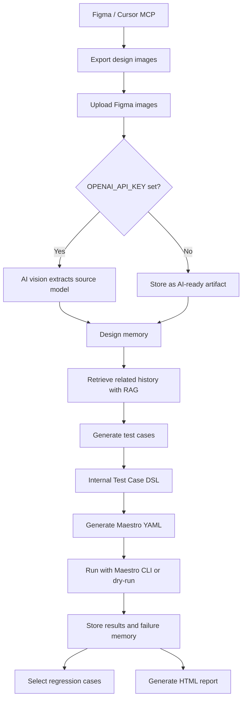
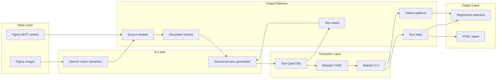
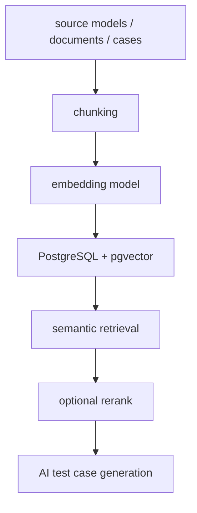

# AI App Test Platform MVP

A deployable MVP for AI-assisted mobile app testing. It uses Maestro as the first automation executor while keeping an internal Test Case DSL, so Appium, Playwright, or device-cloud executors can be added later.

## Capabilities

- Upload Figma MCP context and Figma design images
- Retrieve related context with the built-in lightweight RAG layer
- Generate structured test cases and persist them in SQLite
- Convert internal Test Case DSL into Maestro YAML flows
- Select regression cases from changed features, screens, and change summaries
- Run in dry-run mode or call the local Maestro CLI
- Generate HTML test reports
- Provide a built-in Web UI and REST API

## Quick Start

Recommended npm entrypoint:

```bash
npm run setup
npm run dev
```

Open:

```text
http://127.0.0.1:8080
```

You can also run the Python server directly:

```bash
python3 -m ai_test_platform.server
```

Default database file:

```text
./data/app.db
```

## Main Workflow



Workflow summary:

1. Export one or more screens from Figma as PNG/JPG/WebP.
2. Upload the design images in the Web UI.
3. If OpenAI is configured, the platform extracts UI text, controls, states, risks, and testable points into a source model.
4. The source model and related artifacts are stored as project memory.
5. The generator retrieves related design/history context through the lightweight RAG layer.
6. Test cases are generated as the platform's internal Test Case DSL.
7. The DSL is converted into Maestro YAML.
8. Maestro runs the generated flows in dry-run mode or through the local Maestro CLI.
9. Run results, failure patterns, and case statistics feed back into regression selection.

## Design Architecture



Current implementation notes:

- The active MVP is Figma-only. PRD ingestion is intentionally out of the main path.
- OpenAI is optional. Without `OPENAI_API_KEY`, the system stores Figma images as AI-ready artifacts and uses rule-based fallback generation.
- Maestro is optional for local development. Without `MAESTRO_ENABLED=true`, execution uses dry-run mode.
- The platform stores its own Test Case DSL first and generates Maestro YAML as an executor artifact.

## RAG and Embedding Roadmap

Current MVP RAG is lightweight:

```text
document chunks + token similarity + feature/screen metadata boost
```

It does not yet use embeddings or a vector database.

Recommended upgrade path:



The retrieval interface can remain similar while the backend changes from token matching to vector search.

## Docker

```bash
docker build -t ai-app-test-platform .
docker run --rm -p 8080:8080 -v "$PWD/data:/app/data" ai-app-test-platform
```

## Maestro Execution

The default execution mode is dry-run, so the platform can run even without a device or Maestro CLI.

If Maestro is installed locally and you want real execution:

```bash
npm run dev:maestro
```

The runner writes flows to:

```text
./data/maestro_flows
```

Then it attempts to run:

```bash
maestro test <flow-file>
```

Maestro CLI is an optional dependency. Official installation options include:

```bash
curl -fsSL "https://get.maestro.mobile.dev" | bash
```

On macOS, Homebrew is also available:

```bash
brew tap mobile-dev-inc/tap
brew install mobile-dev-inc/tap/maestro
```

Real Maestro execution also requires Java 17+ and a running Android Emulator, iOS Simulator, or connected device.

## Dependencies

This MVP has no third-party Python dependency. The HTTP server, SQLite storage, lightweight RAG layer, and OpenAI API calls are implemented with the Python standard library, so `npm install` does not download any runtime packages.

## Figma-Only MVP Mode

The current MVP intentionally focuses on Figma-driven testing. PRD ingestion is hidden from the UI and the generator no longer creates PRD/Figma alignment cases.

Recommended flow:

1. Use Cursor or another MCP-capable tool to connect to Figma MCP.
2. Export one or more Figma design screens as PNG/JPG/WebP.
3. Upload all design images in the Web UI.
4. If `OPENAI_API_KEY` is set, uploaded Figma images are parsed by OpenAI vision into source models.
5. Generate test cases from the Figma design context.
6. Generate Maestro flows and run them with `npm run dev:maestro`.

Without `OPENAI_API_KEY`, uploaded images are stored as AI-ready artifacts and the system falls back to rule-based generation.

`LlamaIndex`, `pgvector`, and `LangGraph` are production-upgrade recommendations, not required by the current MVP. For a production version, a likely stack is:

```text
FastAPI + LlamaIndex + PostgreSQL/pgvector + LangGraph/Temporal
```

## AI Configuration

The platform uses real AI only when `OPENAI_API_KEY` is set. Without it, test case generation falls back to the deterministic rule-based generator.

```bash
export OPENAI_API_KEY=...
export AI_MODEL=gpt-4.1-mini
npm run dev
```

Current AI usage:

- OpenAI Responses API
- Structured Outputs with JSON Schema
- RAG context + Figma/design context -> structured Test Case DSL

Status endpoint:

```text
GET /api/ai/status
```

## API Summary

- `GET /api/health`
- `GET /api/ai/status`
- `POST /api/documents`
- `GET /api/documents`
- `POST /api/source-files`
- `GET /api/source-files`
- `POST /api/figma/mcp-context`
- `GET /api/figma/artifacts`
- `POST /api/generate-cases`
- `GET /api/test-cases`
- `GET /api/memory`
- `GET /api/memory/context`
- `POST /api/source-models`
- `GET /api/source-models`
- `POST /api/change-sets`
- `POST /api/case-suggestions`
- `POST /api/test-cases/{id}/approve`
- `POST /api/test-cases/{id}/maestro`
- `POST /api/regression/select`
- `POST /api/runs`
- `GET /api/runs/{id}`
- `GET /api/reports/{run_id}.html`

## Design Choices

The first version intentionally uses only the Python standard library so it can run in a clean environment. Suggested production upgrades:

- API: FastAPI
- RAG: LlamaIndex + pgvector
- Workflow: LangGraph or Temporal
- Queue: Celery / Dramatiq
- Storage: PostgreSQL + S3/MinIO
- Real execution: Maestro Cloud or a self-hosted device lab

## Project Memory

The MVP includes explainable testing memory rather than black-box conversation memory:

- Source Memory: Figma design context, Figma images, historical case, and bug documents
- Derived Memory: feature, screen, case-source links, and case-tag links
- Execution Memory: case run count, pass rate, latest status, failure count, and flaky score
- Failure Patterns: aggregated failure or blocked outputs

Regression selection uses these memories to increase the weight of recently failed cases, cases with failure history, and cases with stability risk.
